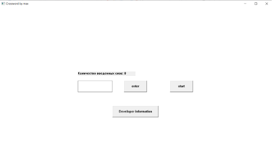
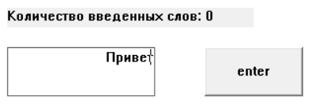
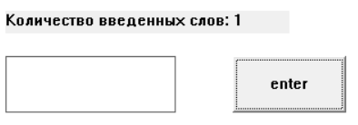
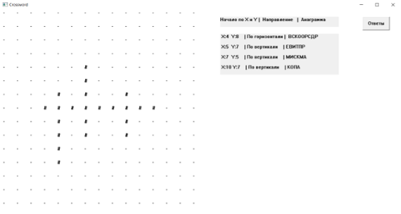
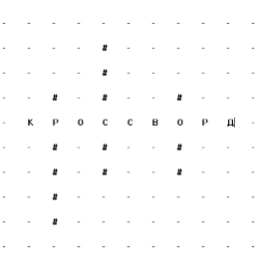
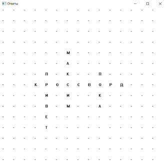

# winapi-crossword-game

**КУРСОВАЯ РАБОТА**

**Теоретические сведения**

Кроссво́рд — головоломка, представляющая собой переплетение рядов клеточек, которые заполняются словами по заданным значениям. Слова могут располагаться как вертикально, так и горизонатльно.

Графический интерфейс – система средств для взаимодействия пользователя с компьютером, основанная на представлении всех доступных пользователю системных объектов и функций в виде графических компонентов экрана. Компьютерная игра без визуальной составляющей – обычная программа, работающая с входными и выходными данными, никак более их не преобразующая. Такая компьютерная игра не интересна пользователям, так как она не является интуитивно понятной.

В моей курсовой работе графический интерфейс реализован при помощи функций WinAPI.

Ряд функций, описанный в рассматриваемой библиотеке, выглядит следующим образом: создание окна, его изменения – управление им, мониторинг ввода команд с клавиатуры, функции создания, изменения окон.

**Цель и задачи**

1. Целью данной курсовой работы является разработать графическое приложение, представляющее собой игру «Кроссворд», обладающую функциями оптимальной расстановки слов на поле размером 15 на 15.

Для достижения данной цели были выделены следующие задачи:

1. Анализ и подбор лучшего алгоритма для расстановки слов;
2. Компьютерная реализация разработанного алгоритма игры.

**Оптимальный алгоритм для составления Кроссворда**

Придумав случайные слова, совсем не факт, что из них получится кроссворд, нужно учесть что поле ограничено (в моем случае это 15 клеток), также учитывать что слова соединяются с помощью совпадающих букв, еще учитывать некорректные пересечения слов. Поэтому, передо мной стояла задача продумать оптимальный алгоритм составителя кроссворда, чтобы на доску не только поместилось максимальное количество слов, но и еще, чтобы они не конфликтовали между собой.

Работа моего алгоритма состоит в рекурсивной расстановке слов:  
1\. Слова сортируются от самого длинного к самому короткому;  
2\. На поле ставится самое длинное слово посередине горизонтально;  
3\. Далее вызываем функцию расстановки слов, которая рекурсивно расставит слова(подробнее о ней на стр. 9).

**Результаты работы**

\-Программа на вход получает слова(максимум 20):

  

-Рис. 1 Начальное окно

Записываем слово в форму, нажимаем enter, “Количество введенных слов” увеличивается:

  

-Рис. 2 До нажатия кнопки “enter”

  

-Рис. 3 После нажатия кнопки “enter”

После введенных слов мы нажимаем кнопку “start” и появляется следующее окно с сгенерированным кроссвордом:

  

-Рис. 4 Окно с кроссвордом

На рисунке 4 мы видим в левой части сгенерированный кроссворд со скрытыми буквами, пользователь может попробовать решить его с помощью подсказок анаграммы в правой части. Подсказка справа состоит из координат начала слова, его ориентации-горизонтальной или вертикальной и анаграммой слова.

Поле кроссворда состоит из форм, тем самым пользователь может заменить # на нужные буквы:

  

-Рис. 5 Введенное слово

Также на рисунке 4 мы видим в правом верхнем углу окна кнопку “ответы”, очевидно оно выдаст нам ключи к кроссворду, давайте же нажмем:

  

-Рис. 6 Окно с ответами

**Основные функции и структуры кода программы.**

– LRESULT WINAPI WndProc_host_window – функция обработки сообщений для основного окна игры.

- void lookForMatch – функция поиска на последнем поставленном слове подходящих букв на словах которые еще не поставлены на поле  
    В случае если слова нашли совпадающую букву, то вызывается void checkBounds которая проверяет, может ли слово, которое потенциально подходит, коректно встать на поле, в случае удачи рекурсивно вызывается void lookForMatch, в которой уже последнее добавленное слово-это наше найденное слово.
- void scramble_str – функция которая делает аннаграммы из введенных слов

